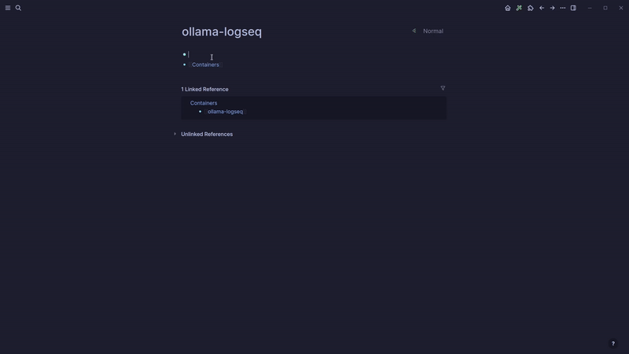
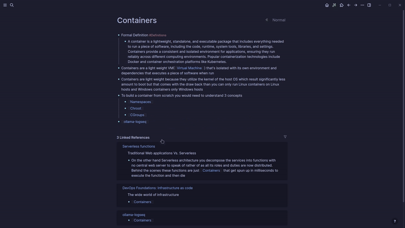
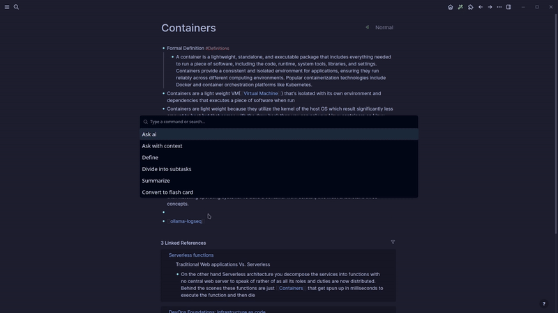

>If this plugin helps you, I'd really appreciate your support. You can [buy me a coffee here. ](https://www.buymeacoffee.com/omagdy)
# 🦙 ollama-logseq plugin

A plugin to integrate [ollama](https://github.com/jmorganca/ollama) with [logseq](https://github.com/logseq/logseq)

# Get Started
- First you will need to setup [ollama](https://github.com/jmorganca/ollama) you can check their github repo for instructions on how to setup ollama
- That's it once you setup ollama you should be able to use the plugin with no problem

# Features
- The plugin currently has 5 commands
  - Ask Ai -> which is a prompt the AI freely without any context
  - Ask Ai with context -> This is the same as Ask Ai but it gives the model the context of the current page
  - Summarize -> Summarizs the whole page
  - Create a flash card
  - Divide a todo task into subtasks
- Respects theming
- Context menu commands(Make a flash card, Divide task into subtasks)
- A slash command via /ollama
- Button in tool bar
- Settings for changing the host of the model, the model itself and a shortcut to open the plugin command pallete

# Demo

If you have any features suggestions feel free to open an issue

