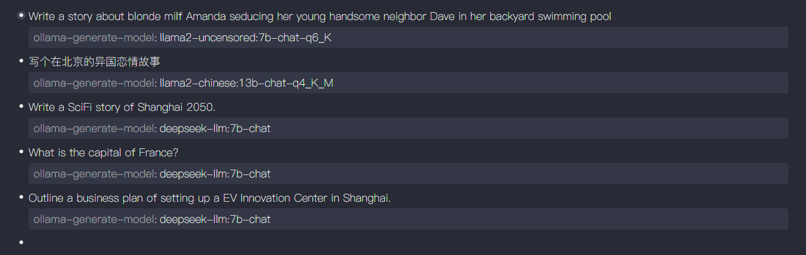
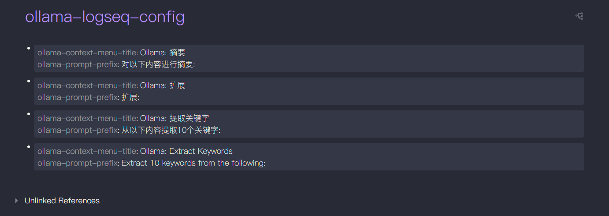
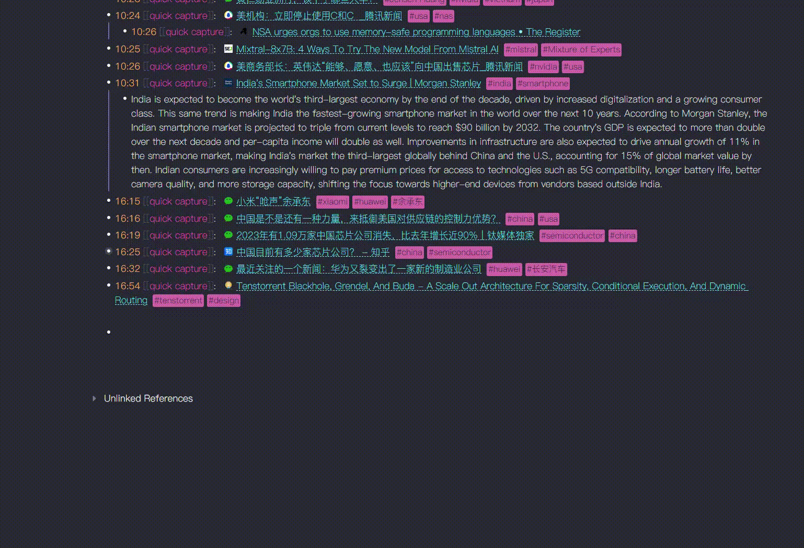

# 🦙 ollama-logseq plugin

A plugin to integrate [ollama](https://github.com/jmorganca/ollama) with [logseq](https://github.com/logseq/logseq)

# Get Started
- First you will need to setup [ollama](https://github.com/jmorganca/ollama) you can check their github repo for instructions on how to setup ollama
- That's it once you setup ollama you should be able to use the plugin with no problem

> Note: If you are on windows make sure to open WSL in the background for the model to work properly

# Features
- The plugin currently has 6 commands
  - Ask Ai -> which is a prompt the AI freely without any context
  - Ask Ai with context -> This is the same as Ask Ai but it gives the model the context of the current page
  - Summarize -> Summarizs the whole page
  - Summarize Block
  - Create a flash card
  - Divide a todo task into subtasks
- Respects theming
- Context menu commands
  - Summarize Block
  - Make a flash card
  - Divide task into subtasks
  - Prompt from block
  - Expand block
- A slash command via /ollama
- Button in tool bar
- Settings for changing the host of the model, the model itself and a shortcut to open the plugin command palette
- Block properties to select model
- Use configuration page `ollama-logseq-config` to add more context manual commands

## Block Properties
Ollama offers many different models to choose from for various of tasks. This feature configures model on the per block base and the attribute is also used by its immediate children while using context menu commands for blocks. The properties are named after the [Ollama's generate API](https://github.com/jmorganca/ollama/blob/main/docs/api.md#generate-a-completion) and currently, only the `model` is used. Add the `ollama-generate-model:: model_name` at the end of the block to specify the model to use for the block and its immediate children. 
```
Write a SciFi story of Shanghai 2050. 
ollama-generate-model:: deepseek-llm:7b-chat
```
Currently, three context menu commands would be affected by this properties.
- Ollama: Prompt from Block
- Ollama: Summarize Block
- Ollama: Expand Block 



## Configuration Page `ollama-logseq-config`
The plugin also reads the page `ollama-logseq-config` to add more context commands. The page should be a markdown page with the following format.

```
ollama-context-menu-title:: Ollama: Extract Keywords
ollama-prompt-prefix:: Extract 10 keywords from the following:
```



Each one of the block with these two properties will create a new context menu command after restarting logseq. The prefix is added in front of the text of the block when the command is invokved on the block. 

# Demo


# Contribution
If you have any features suggestions feel free to open an issue

>If this plugin helps you, I'd really appreciate your support. You can [buy me a coffee here. ](https://www.buymeacoffee.com/omagdy)
